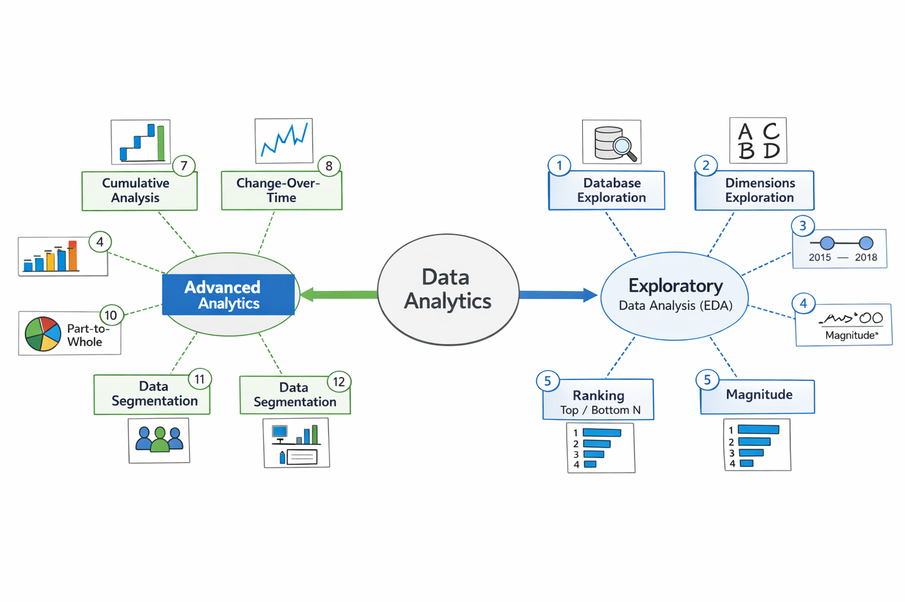

<p align="center">
  
</p>

# 📊 Data Analytics Project — SQL + EDA + Advanced Analytics + Reporting

---

## 📘 Overview
This project represents a complete end‑to‑end Data Analytics workflow built using SQL Server.  
It covers the full analytical lifecycle starting from **Exploratory Data Analysis (EDA)**, moving into **Advanced Analytics**, and ending with **Customer & Product Reporting**.

The project includes:
- Clean, structured SQL scripts  
- Analytical Views (Gold Layer)  
- Customer & Product Reports  
- Data Segmentation  
- KPIs & Business Metrics  
- Visual Diagrams explaining the analytical framework  

---

## 🏗️ Project Architecture

### **1. Exploratory Data Analysis (EDA)**
- Database Exploration  
- Dimensions Exploration  
- Date Exploration  
- Measures Exploration  
- Magnitude Analysis  
- Ranking (Top N / Bottom N)

### **2. Advanced Analytics**
- Change‑Over‑Time (Trends)  
- Cumulative Analysis  
- Performance Analysis  
- Part‑to‑Whole  
- Data Segmentation  
- Reporting Layer  

---

## 📂 Folder Structure
```
├── sql-scripts/
│   ├── 01_exploration.sql
│   ├── 02_dimensions.sql
│   ├── 03_dates.sql
│   ├── ...
│   ├── 11_report_customer.sql
│   └── 12_report_products.sql
│
├── project-diagrams/
│   └── data_analytics_structure.png
│
└── README.md
```

---

## 🧠 Key Analytical Views

### **Customer Report (gold.report_customer)**
- Customer Segmentation (VIP / Regular / New)  
- Age Segmentation  
- Recency  
- Total Orders  
- Total Sales  
- Average Order Value  
- Average Monthly Spend  
- Lifespan  

### **Product Report (gold.report_products)**
- Product Segmentation (High / Mid / Low Performer)  
- Recency  
- Total Orders  
- Total Sales  
- Total Customers  
- Average Selling Price  
- Average Order Revenue  
- Average Monthly Revenue  

---

## 📊 KPIs Included
- Recency  
- Frequency  
- Monetary Value  
- AOV (Average Order Value)  
- AOR (Average Order Revenue)  
- Monthly Revenue  
- Customer Lifetime Metrics  
- Product Performance Metrics  

---

## ▶️ How to Run
1. Restore or connect to the database  
2. Run scripts in `sql-scripts` folder in order  
3. Views will be created in the **gold** schema  
4. Use Power BI / Tableau / Excel to connect and visualize the results  

---

## 🎯 Project Goals
- Build a clean, modular SQL analytics pipeline  
- Apply EDA and Advanced Analytics techniques  
- Produce business‑ready reports  
- Demonstrate professional SQL workflow and documentation  

---

# 🇸🇦 النسخة العربية

## 📘 نظرة عامة
المشروع ده بيمثل دورة تحليل بيانات كاملة باستخدام SQL Server،  
من أول **التحليل الاستكشافي (EDA)** لحد **التحليلات المتقدمة** وبناء **تقارير العملاء والمنتجات**.

المشروع يشمل:
- سكريبتات SQL منظمة  
- Views جاهزة في طبقة Gold  
- تقارير تحليلية  
- تقسيم العملاء والمنتجات  
- مؤشرات أداء (KPIs)  
- مخططات توضيحية  

---

## 🏗️ هيكل المشروع
### **التحليل الاستكشافي (EDA)**
- استكشاف قواعد البيانات  
- استكشاف الأبعاد  
- استكشاف التواريخ  
- استكشاف المقاييس  
- تحليل الحجم  
- الترتيب (Top N / Bottom N)

### **التحليلات المتقدمة**
- التحليل عبر الزمن  
- التحليل التراكمي  
- تحليل الأداء  
- جزء من الكل  
- التقسيم  
- التقارير  

---

## 📂 هيكل الملفات
```
sql-scripts/
project-diagrams/
README.md
```

---

## 📊 أهم الـ Views
### **تقرير العملاء**
- تقسيم العملاء  
- العمر  
- Recency  
- إجمالي الطلبات  
- إجمالي المبيعات  
- متوسط قيمة الطلب  
- متوسط الإنفاق الشهري  

### **تقرير المنتجات**
- تقسيم المنتجات  
- Recency  
- إجمالي الطلبات  
- إجمالي المبيعات  
- إجمالي العملاء  
- متوسط سعر البيع  
- متوسط إيراد الطلب  
- متوسط الإيراد الشهري  

---

## ▶️ طريقة التشغيل
1. شغّل قاعدة البيانات  
2. نفّذ السكريبتات بالترتيب  
3. الـ Views هتتولد في Schema: **gold**  
4. اربط Power BI أو أي أداة Visualization  

---

## 🎯 هدف المشروع
- بناء Pipeline تحليلي احترافي  
- تطبيق EDA + Advanced Analytics  
- إنتاج تقارير جاهزة للأعمال  
- عرض مهارات SQL بشكل قوي وواضح  

---

# 📬 Connect With Me

<p align="center">

  <a href="https://www.linkedin.com/in/amir-ayman-664513103/" target="_blank">
    
  </a>

  <a href="https://github.com/amirayman20" target="_blank">
    
  </a>

  <a href="mailto:amirayman20@gmail.com">
    
  </a>

</p>
